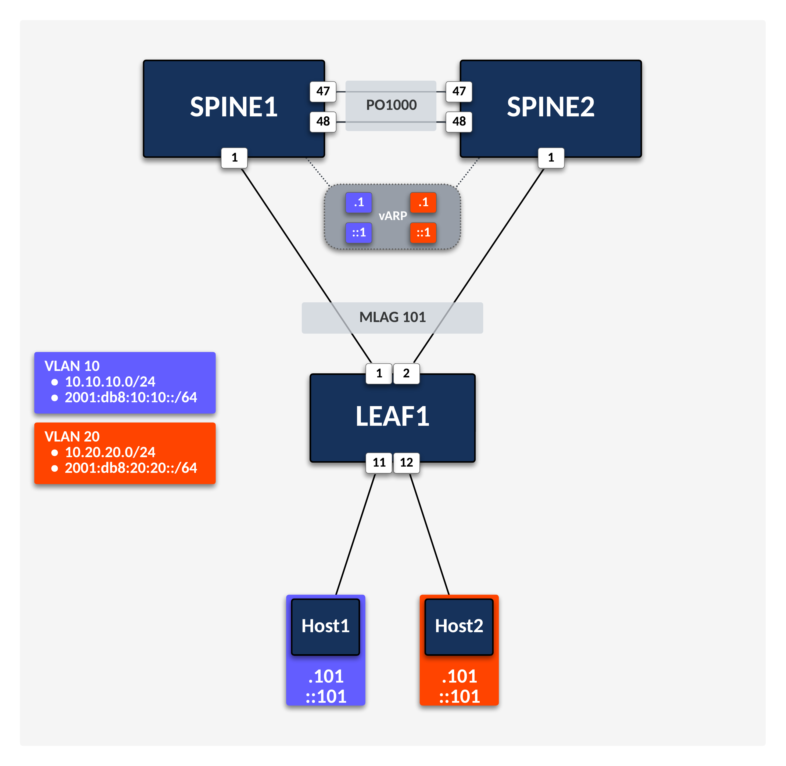

# Arista EOS Tips for Network Operators

> [!IMPORTANT]
> The average deployment time for this lab is ~5 minutes. Please wait until the `postCreateCommand` process has finished before interacting with the lab.

This pre-configured lab is intended to be used as a sandbox companion to the [EOS Tips for Network Operators Guide](https://tech-library.arista.com/eos/eos_ops/) in [Arista's Tech Library](https://tech-library.arista.com/).

## Credentials

Username: `admin`

Password: `admin`

## Topology

## Navigating the Lab

Quick Links:

- [Interacting with the Lab](https://aclabs.arista.com/quickstart/#interacting-with-the-lab)
- [Tips and Troubleshooting](https://aclabs.arista.com/quickstart/#tips-and-troubleshooting)

Happy Labbing!
